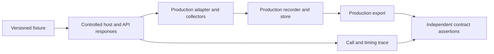

# Harness design and production boundaries

[Testing strategy](README.md)

**Status: proposed implementation design.** File names, interfaces, runner choices, and commands in this section are targets for later implementation, not existing repository capabilities.

## Run the same code we ship

Tests must load the production Lua adapters, collectors, recorder, storage, and export code. They replace external inputs such as WoW functions, clocks, timers, and identity allocation. They must not replace the collector with a second implementation that already returns the desired records.



The initial scope is gameplay recording and persistence. External [catalog acquisition](../05-acquisition/README.md) tools should later use the same fixture/provenance principles for their own parsers; they are not a prerequisite for testing the addon.

## Proposed tooling

Use a pinned **LuaUnit** dependency for Lua assertions and test reporting, with a small repository-owned replay driver. LuaUnit supports standalone Lua tests and machine-readable reports. A Python entry point can orchestrate the Lua process, validate fixture JSON, perform independent export checks, and collect results. It must not translate the recording logic into Python. [TEST-LUAUNIT](../reference/sources.md#test-luaunit)

Start the portable core with a Lua 5.1-compatible language/library subset and a pinned interpreter as a development baseline. This is a project choice, not a statement that WF's embedded runtime is exactly stock Lua 5.1. Once WF is available, document the actual required language/extensions and test the chosen host's compatibility with them. Newer interpreter passes are optional additional evidence, not a replacement for the selected compatibility baseline.

Pin the interpreter, LuaUnit, fixture decoder, and any serializer dependencies before the first harness PR lands. Retain third-party license information. Test runs should need neither a game login nor network access after dependencies are prepared.

## Boundaries to inject

| Boundary | Production responsibility | Harness replacement |
| --- | --- | --- |
| Event registration/dispatch | Register selected events and receive arguments | Small frame/event host that records subscriptions and delivers only permitted notifications |
| Client adapter | Decode the selected build's payloads and read APIs | Real adapter against an explicit profile of scripted native functions |
| API state | Quest/loot/unit/map/item values | Strict return plans, including shared mutable objects, missing values, and failures |
| Clock | Wall-clock and elapsed time | Independent deterministic wall and monotonic clocks |
| Scheduler | Deferred scans, request timeouts, bounded work | Deterministic callback queue advanced by trace steps |
| Session/ID allocation | Unique identities and increasing sequence numbers | Injected repeatable ID source, including collision scenarios |
| Storage lifecycle | Accepted in-memory records and restored SavedVariables | Real store plus simulated client snapshot/restore boundaries |
| Diagnostics | Bounded errors, skipped fields, gaps | Captured sink whose output is also asserted |

The core receives these dependencies explicitly. The production bootstrap supplies real WoW functions. Avoid scattered `_G` lookups and hidden `GetTime()` calls in domain logic; they make behavior difficult to reproduce and audit.

## Strictness is essential

An unconfigured API call fails a test with its name, safe readable argument context, and trace position. It must not return an empty table or nil by default. Those are meaningful game outcomes and would hide a missing stub or wrong call. Error reporting must not format unreadable values.

Return plans must be able to specify:

- Function absent, event unknown, registration denied, or call throwing.
- Exact ordered argument and return tuples, including interior/trailing nil values.
- A table returned by identity and reused or mutated later.
- Different results at different scheduled reads.
- Pending, failed, duplicate, unrelated, or out-of-order metadata responses.
- Readable, unavailable, and modeled restricted inputs.

Assert required call counts and forbidden calls where they express behavior, such as no source read after a loot window closes. Avoid overfitting unrelated internal call order. Unconsumed required responses, unexpected calls/errors, and callbacks remaining beyond a scenario's declared completion policy all fail the case. Deliberately injected errors must have explicit recovery and diagnostic expectations.

## Time and ordering

Use no real sleeping. Trace steps decide when to deliver an event, change API state, advance a clock, execute due callbacks, or simulate reload. Callbacks at the same logical time use an explicit stable tie-breaker recorded in the trace. This models a particular input ordering; it does not declare a universal WoW ordering rule.

Keep wall-clock jumps independent from monotonic elapsed time. Test equal timestamps, delayed metadata, transitions, and a callback scheduled before a session ended but delivered afterward. Old callbacks must not attach records to a new session or reused interaction.

Fresh test state includes globals, registrations, saved data, caches, scheduler, ID allocator, diagnostics, and random seed. Start with a fresh Lua process per fixture for isolation; batch fixtures later only if reset-equivalence tests show the optimization is safe. Change test execution order in a seeded run to reveal cross-test contamination.

## Restriction models have limits

The fake adapter should expose readability decisions and reject modeled restricted data before copying, comparison, formatting, or serialization. Sentinel objects can detect some forbidden accesses and prove the collector invokes the approved boundary checks.

An ordinary Lua sentinel cannot faithfully reproduce the client's native secret-value semantics, taint, secure execution, or every operation on a secret scalar. Tests of the guard path are useful, but they are not permission tests. Use actual client validation for those properties; do not call sentinel tests “secret-value compatibility.”

## Record ownership

Lua tables are references; retaining a caller's table can let later code change stored data. The production capture boundary must select readable allowed fields into recorder-owned plain data. A generic deep copy of an arbitrary API object is not an acceptable alternative. [TEST-LUA](../reference/sources.md#test-lua)

After validation, the store owns the committed observation. Readers/exporters receive defensive copies or a traversal interface that does not expose mutable internal tables. Tests should deliberately mutate inputs, nested values, consumer copies, and metadata caches, then re-read the store and compare the committed prefix.

A metatable with `__newindex` is not a complete freeze for ordinary tables: writes to existing fields can bypass it. Use ownership boundaries and repeated structural comparisons as the protection; a read-only proxy can be an additional diagnostic, not the sole guarantee.

## Test layers

| Suite | Runs what | Main responsibility |
| --- | --- | --- |
| `contracts` | Schema validators, ownership/append primitives, pure comparison rules | Validate types, identity, evidence, missing-data semantics and immutable history |
| `replay` | Real adapters, collectors, recorder, queues and store | Replay scenarios across supported profiles; assert full behavior |
| `persistence` | Real export/restore/migration/import paths as implemented | Preserve records across memory generations and serialized boundaries |
| `adversarial` | Seeded generators and injected failures through production boundaries | Exercise hostile timing, malformed inputs, aliasing, limits and error recovery |
| `package` | Actual distribution manifest/archive | Verify production load order, declared SavedVariables and exclusion of harness files |
| `client` | Named manual/in-client validation on an explicit product/build | Establish that client's actual events, permissions, timing and native saving; WF claims require WF tests |

Small deterministic cases run on every implementation PR. Longer seeded workloads and broader fault/mutation experiments can run on a scheduled job. Any discovered failure becomes a small permanent PR regression.

## Proposed repository layout

```text
tests/
  run.lua
  support/             # host, clocks, scheduler, assertions, seeded generators
  profiles/            # explicit reference and verified WF client contracts
  fixtures/
    synthetic/
    captured/<product>/<build>/
    saved-versions/
  expected/            # reviewed output and diagnostic expectations
  unit/
  replay/
  persistence/
  package/
  mechanics.json       # admitted mechanics, profiles, tests and evidence
tools/
  test.py              # proposed cross-platform entry point
.github/workflows/
  tests.yml            # proposed required PR checks
```

The recorder source location can follow the later addon layout. Test loading must follow the same relevant manifest order and namespace convention as the production package. An end-to-end replay that bypasses the bootstrap needs a complementary package/bootstrap test so manifest regressions are not hidden.
